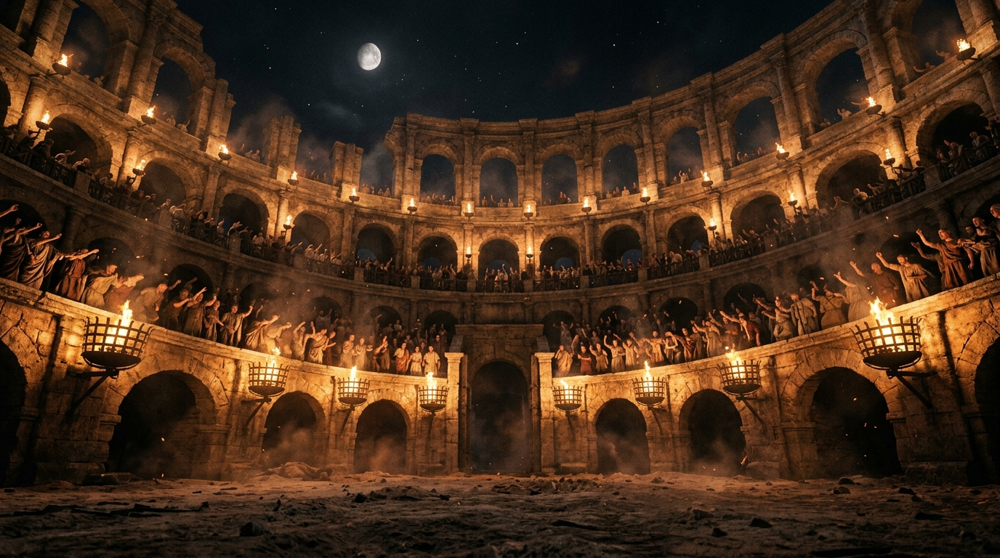

# ⚔️ QuizArena — Real-Time Multiplayer Trivia Battle Royale

<p align="center">
  
</p>

<p align="center">
  <b>A fast-paced, competitive multiplayer quiz game built with Spring Boot, WebSockets (STOMP/SockJS), and React 19 + Tailwind CSS.</b>
</p>

<p align="center">
  
  
  
  
  
  
</p>

---

## 📖 Table of Contents
- [Overview](#-overview)
- [Key Features](#-key-features)
- [Architecture & Tech Stack](#-architecture--tech-stack)
- [Scoring Formula](#-scoring-formula)
- [Current Implementation Notes](#-current-implementation-notes)
- [Upcoming Roadmap](#-upcoming-roadmap)
- [Getting Started](#-getting-started)
- [Project Structure](#-project-structure)

---

## 🏛️ Overview

**QuizArena** turns ordinary trivia into an electrifying gladiator arena showdown. Players enter customized battle rooms using 6-character room codes, equip distinct **Gothic Warrior Archetype Avatars**, and compete under strict quadratic countdown timers. Real-time scores and leaderboards synchronize instantly across all connected clients via WebSocket STOMP messaging.

---

## ✨ Key Features

### 1. 🛡️ Gladiator Preparation Gallery (Waiting Room)
- **Room Code Plaque**: One-click code copying and real-time live server heartbeat indicator.
- **Quiz Briefing Card**: Displays question counts, dynamic topic badges, and key concepts.
- **Host Champion Pedestal**: Elevated glowing stage for the match creator.
- **4-Column Warrior Avatar Grid**: Responsive grid displaying joined gladiators with unique warrior emblems (Paladin, Berserker, Assassin, Samurai, Crusader, Valkyrie).
- **Segmented LED Readiness Bar**: Visual progress indicator showing player thresholds before launching.
- **Interactive Trivia Ticker & Lobby Chat**: Real-time room messaging and contextual lore facts.

### 2. ⚔️ The Live Colosseum Arena (`Room.jsx`)
- **Atmospheric Living Backdrop**: Authentic Roman Colosseum sand arena with living torchlight flickers, floating ember sparks, and subtle mist depth.
- **Circular Neon Countdown Ring**: Dynamic SVG timer ring that transitions from Cyan $\rightarrow$ Amber $\rightarrow$ Pulsing Red as the clock winds down.
- **Combat Answer Pads (2x2 Grid)**: Color-coded pads (Rose `[A]`, Cyan `[B]`, Emerald `[C]`, Amber `[D]`) with responsive click feedback.
- **Live Rival Mini-Leaderboard**: Real-time competitor tracking with warrior avatar badges, live scores, and instant answer submission indicators (`✔ Submitted`).
- **Radiant Victory Flare**: Golden & emerald celebratory radial light surge upon answering correctly.
- **Champion Standings Podium**: 1st (Gold 👑), 2nd (Silver 🥈), and 3rd (Bronze 🥉) elevated pedestals for round results and final match victory.

### 3. ⚡ Ultra-Fast Game Synchronization
- Sub-second room updates powered by **Spring WebSocket STOMP over SockJS**.
- Multi-phase turn progression: `START (Countdown)` $\rightarrow$ `QUESTION (Text peek)` $\rightarrow$ `ANSWERING (Active timer)` $\rightarrow$ `RESULT (Feedback)` $\rightarrow$ `LEADERBOARD` $\rightarrow$ `GAME_OVER`.

---

## 📐 Scoring Formula

QuizArena rewards both **accuracy** and **split-second reaction speed**. Points decay quadratically every second according to:

$$\text{Score} = \left\lceil 1000 - \frac{10 \cdot n \cdot (n + 1)}{2} \right\rceil$$

*Where $n$ represents the number of seconds elapsed before the correct answer is locked in.*

- **Answered in 0s**: $1000\text{ pts}$
- **Answered in 3s**: $940\text{ pts}$
- **Answered in 6s**: $790\text{ pts}$
- **Wrong answer**: $0\text{ pts}$

---

## 🛠️ Architecture & Tech Stack

### Backend
- **Framework**: Spring Boot 3.x (Java 21)
- **Real-Time Protocol**: Spring WebSocket + STOMP Messaging + SockJS
- **Database & ORM**: PostgreSQL / MySQL with Spring Data JPA & Hibernate
- **Build Tool**: Gradle

### Frontend
- **Framework**: React 19 with React Router v7
- **Styling**: Tailwind CSS v4 + Custom GPU-accelerated glow utilities
- **Build System**: Vite 8 (Hot Module Replacement, sub-second production builds)
- **Icons & Graphics**: Custom SVG Cel-Shaded Esports Warrior Badges

---

## 📌 Current Implementation Notes

> [!NOTE]
> **Metadata & Static Content in Waiting Room:**
> In the current development build, certain quiz summary points and trivia lore facts in the Waiting Room are dynamically generated or hold placeholder values. These will be fully connected to user-defined metadata once the upcoming **Quiz Creator** flow is implemented.

---

## 🔮 Upcoming Roadmap

- [ ] **Custom Quiz Creator (`CreateQuiz.jsx`)**: Full-featured builder to create quizzes with custom time limits, categories, and question difficulty tags.
- [ ] **"Explore" Public Quiz Hub**: Integration with **Open Trivia Database (OpenTDB)** and **QuizAPI** to fetch thousands of free, ready-to-play trivia quizzes with 1-click room creation.
- [ ] **Authentication & User Profiles**: JWT-based Login/Register, match history, leaderboard win rates, and custom unlockable warrior badges.
- [ ] **Sound FX & Arena Crowds**: Web Audio API integration for authentic sword clashes, fanfare chimes, and roar crescendos on high-speed streaks.
- [ ] **Backend Concurrency Optimization**: Multi-threaded scheduled task execution and Redis Pub/Sub for cross-server match scaling.

---

## 🚀 Getting Started

### Prerequisites
- **Java 21+** (JDK)
- **Node.js 20+** and **npm**
- **PostgreSQL** or **MySQL** instance

### 1. Clone the Repository
```bash
git clone https://github.com/your-username/quiz-arena.git
cd quiz-arena
```

### 2. Configure Backend Database
Edit `src/main/resources/application.properties` with your database credentials:
```properties
spring.datasource.url=jdbc:postgresql://localhost:5432/quizarena
spring.datasource.username=postgres
spring.datasource.password=your_password
spring.jpa.hibernate.ddl-auto=update
```

### 3. Run Backend (Spring Boot)
```bash
./gradlew bootRun
# On Windows:
.\gradlew.bat bootRun
```
*The Spring Boot server will start on `http://localhost:8080` (WebSocket endpoint: `/ws`).*

### 4. Run Frontend (React + Vite)
```bash
cd frontend
npm install
npm run dev
```
*The Vite dev server will start on `http://localhost:5173`.*

---

## 📂 Project Structure

```
quiz-arena/
├── src/main/java/com/quizarena/
│   ├── controller/      # REST API & STOMP Message Mappings
│   ├── entity/          # JPA Database Entities (Quiz, Question)
│   ├── dto/             # Data Transfer Objects (Room, Answer, Player)
│   ├── game/            # GameRoom state & GameManager logic
│   ├── service/         # GameService timer & round scheduler
│   └── repository/      # Spring Data JPA Repositories
│
├── frontend/
│   ├── src/
│   │   ├── assets/      # Colosseum backgrounds & realistic textures
│   │   ├── components/  # CyberAvatar (Warrior Badges), Navbar, QuizCard
│   │   ├── pages/       # Home, WaitingRoom, Room, JoinGame, CreateQuiz, Explore
│   │   ├── index.css    # Tailwind utilities & living arena GPU keyframes
│   │   └── App.jsx      # Router configuration
│   └── package.json
│
├── .gitignore           # Unified repository ignore rules
├── build.gradle         # Spring Boot Gradle dependencies
└── README.md            # Project documentation
```

---

<p align="center">
  Made with ⚔️ by <b>Suleman Muhammad</b>
</p>

